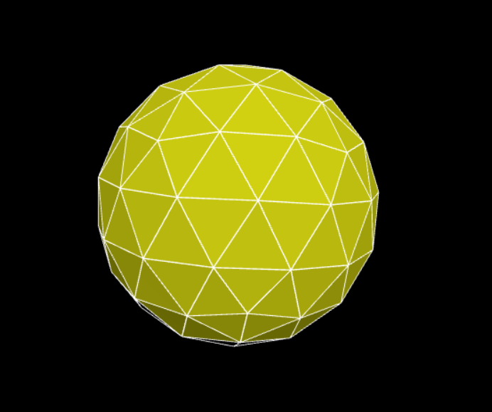

Polyhedron Universe - Explorateur 3D avec Three.js
Une application web interactive conçue avec Three.js qui permet d'explorer des géométries polygonales animées dans un environnement dynamique. Ce projet met l'accent sur les jeux de lumières, les transitions de couleurs et les effets de structure (wireframe).

Fonctionnalités Actuelles
Géométrie de Cristal : Un icosaèdre généré avec un rendu "Flat Shading" pour un aspect facetté.

Double Structure : Affichage simultané du volume plein et de sa structure filaire (wireframe) pour un effet de profondeur.

Lumière Orbitale : Une source lumineuse directionnelle qui tourne automatiquement autour de l'objet pour révéler ses reliefs.

Cycle Chromatique : Animation fluide de la couleur de la lumière passant du Blanc  au Jaune  puis à l'Orange .

Caméra Interactive : Navigation libre (rotation, zoom, panoramique) via OrbitControls.

## Aperçu du projet

 Installation et Lancement
Comme le projet utilise des modules JavaScript, il doit être lancé via un serveur local.

Cloner le projet
git clone https://github.com/Athna12/Test_THREE_JS.git
cd Test_THREE_JS

Ouvrez le dossier 1_Test.

Avec VS Code : Installez l'extension Live Server, faites un clic droit sur index.html et choisissez "Open with Live Server".

Avec Node.js : Utilisez npx serve . ou installez un serveur statique.

Stack Technique

Moteur 3D : Three.js

Contrôles : OrbitControls

Langage : JavaScript moderne

Roadmap (Évolutions à venir)
Ce projet est conçu pour s'enrichir de nouvelles formes et fonctionnalités :

Galerie de formes : De formes personnalisées.

Sélecteur d'objets : Interface utilisateur pour changer de forme en temps réel.

Matériaux avancés : Intégration de textures de verre et de reflets métalliques.

Mode Audio-Réactif : Faire pulser les formes en fonction de la musique.

Licence
Ce projet est sous licence MIT. Libre à vous de l'utiliser et de le modifier !
